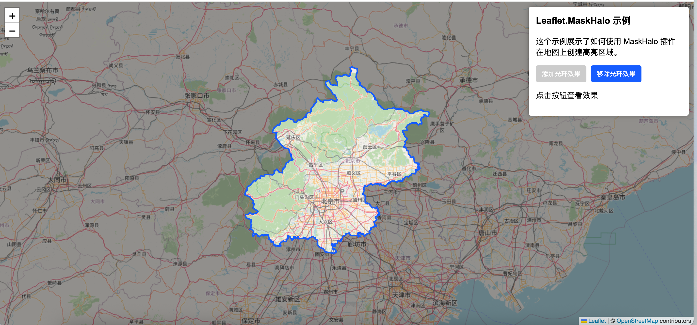

# Leaflet MaskHalo

[](https://www.npmjs.com/package/leaflet.maskhalo)
[](LICENSE)

Leaflet MaskHalo is a plugin for creating halo effects around GeoJSON features on a Leaflet map. It adds a mask that darkens the area outside the specified GeoJSON features and highlights the features with a customizable "halo" effect.

 <!-- Replace with actual demo image/gif when available -->

## Features

- Creates a mask that darkens the area outside GeoJSON features
- Adds a customizable halo effect around GeoJSON features
- Works with any GeoJSON geometry (Polygon, MultiPolygon, etc.)
- Easy to integrate with existing Leaflet maps
- Lightweight and performant

## Installation

### Using npm

```bash
npm install leaflet.maskhalo
```

### Using yarn

```bash
yarn add leaflet.maskhalo
```

### Using pnpm

```bash
pnpm add leaflet.maskhalo
```

### Peer Dependencies

Leaflet MaskHalo requires the following peer dependencies to be installed in your project:

```bash
npm install leaflet @turf/turf
```

## Usage

### Import the plugin

```javascript
import 'leaflet.maskhalo';
```

Or using CommonJS:

```javascript
require('leaflet.maskhalo');
```

### Basic Usage

```javascript
// Create a map
const map = L.map('map').setView([51.505, -0.09], 13);

// Add a tile layer
L.tileLayer('https://{s}.tile.openstreetmap.org/{z}/{x}/{y}.png').addTo(map);

// Sample GeoJSON data
const geojsonData =  {
  type: "FeatureCollection",
  features: [
    {
      "type": "Feature",
      "properties": {},
      "geometry": {
        "type": "Polygon",
        "coordinates": [[
          [117.223901, 40.375538],
          [117.226661, 40.378558],
          [117.229045, 40.386843],
          [117.235382, 40.389556],
          [117.23695, 40.394078],
          [117.240694, 40.394417],
          [117.240484, 40.39763],
          //...
          [117.223901, 40.375538]
        ]]
      }
    }
  ]
};

// Add MaskHalo to the map
const maskHalo = map.maskHalo();
maskHalo.addHalo(geojsonData);
```

### Customizing Styles

```javascript
const maskHalo = map.maskHalo({
  mask: {
    fillColor: '#000',
    fillOpacity: 0.5
  },
  halo: {
    color: '#ff0000',
    weight: 3
  }
});

maskHalo.addHalo(geojsonData);
```

### Removing MaskHalo

```javascript
maskHalo.remove();
```

## API

### `map.maskHalo(options?)`

Creates a new MaskHalo instance.

- `options` (Object, optional):
  - `mask` (PathOptions, optional): Style options for the mask.
  - `halo` (PathOptions, optional): Style options for the halo.

### `maskHalo.addHalo(data)`

Adds a halo effect for the specified GeoJSON data.

- `data` (GeoJSON object or array): The GeoJSON feature(s) to highlight.
  
  support multiple types of geoJson data.

  - `Polygon | Polygon[]`: A object polygon or array of polygon.
  - `MultiPolygon | MultiPolygon[]`: A object multi-polygon or array of multi-polygon.
  - `FeatureCollection<Polygon | MultiPolygon>`: A collection of polygons or multi-polygons.
  - `Feature<Polygon | MultiPolygon>| Feature<Polygon | MultiPolygon>[]`: A feature polygon or multi-polygon or an array of feature polygon or multi-polygon.

### `maskHalo.remove()`

Removes the mask and halo from the map.

## License

This project is licensed under the MIT License - see the [LICENSE](LICENSE) file for details.
